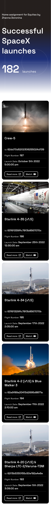

### Comments

- The current implementation is using functional React components, MUI and custom CSS classes.
- The goal was to stay as close as possible to the structure of data presented initially, but enhance design, user experience and responsiveness.
- One of the challenges included dealing with unstable data coming from API. To make sure that this doesn't affect the frontend I decided to use default images and default links that are only used if API data returns faulty values.

### Future steps
Without any restrictions regarding time and API calls the current user experience could be enhanced through:
- implementing search and filtering functionality
- implementing modals with additional information and embedded videos
- implementing a more interactive and creative design concept

### Links
[Github repository](https://github.com/jane-doronina/equitas-frontend-tests)

### Screenshots

| Desktop  | Mobile |
| ------------- | ------------- |
|   |   |
